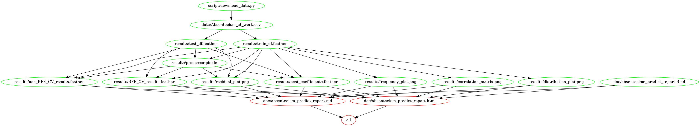

# Absenteeism Hours Predictor

-   Author: MDS DSCI 522 Group 21

## About

In this project, we built three machine learning regression models:
`random forest regressor`,
`support vector machine regressor with linear kernel` and
`ridge regressor` to make predictions on absenteeism time in hours from
the “Absenteeism at work” dataset. Our final model
`support vector machine regressor with linear kernel` performed a decent
job on an unseen test data set, with `negative RMSE` score of -5.966. On
222 test data cases, the average hours that our model missed to predict
is 5.966 hours, which is not bad at all. However, in both the train and
test dataset, our predictor tends to over predict when the actual
absenteeism hours are low and under predict in the case of actual
absenteeism hours are high. Since our prediction results may affect the
decision and judgement that an employer makes when dealing with
absenteeism among employees, we suggest that more sophisticated
approaches on machine learning algorithm and feature selection should be
conducted to improve the prediction model before it is being used to
direct on absenteeism issues at the workplace.

Our data set is chosen from the UCI Machine Learning Repository called
“Absenteeism at work Data Set.” The data set can be found
[here](https://archive.ics.uci.edu/ml/datasets/Absenteeism+at+work#) and
it is created by Andrea Martiniano, Ricardo Pinto Ferreira, and Renato
Jose Sassi from Postgraduate Program in Informatics and Knowledge
Management at Nove de Julho University, Rua Vergueiro(Andrea Martiniano,
Ricardo Pinto Ferreira, and Renato Jose Sassi 2010). The data was
collected at a courier company in Brazil and the database includes the
monthly records of absenteeism of 36 different workers over three years,
starting from July 2007, and how their changes affect their absence rate
over time. This data set contains 740 instances with 21 attributes,
including 8 categorical and 9 numerical features (excluding the target
`Absenteeism time in hours` and the drop feature `ID`,
`Disciplinary failure`, `Body mass index`, `Service time`, and
`Month of absence`). Each row represents information about an employee
with his/her situations of absence, family, workload, and other factors
that might be related to his/her absence at work. Out of the considered
attributes, the absenteeism in hours is the target to predict with the
provided information, and the features are:

-   **ID** (this will be dropped): Individual Identification of each
    employee. There are 36 distinct individuals.

-   **Reason for absence** (categorical feature): Justification for the
    registered absence hours of each employee.

-   **Month of absence** (this will be dropped): The month in which the
    absentee time is registered.

-   **Day of the week** (categorical feature): The five business days of
    the week.

-   **Seasons** (categorical feature): The four seasons of the year with
    summer (1), autumn (2), winter (3), spring (4).

-   **Transportation Expense** (numeric feature): Monthly transportation
    expense of each employee in dollars.

-   **Distance from residence to work** (numeric feature): Distance
    covered by each employee daily in kilometers.

-   **Service Time** (this will be dropped): Service time of each
    employee in years.

-   **Age** (numeric feature): Age of each employee in years.

-   **Workload Average/day** (numeric feature): Workload of each
    employee per day.

-   **Hit target** (numeric feature): achievement percentage (%) of
    periodic goals for each employee.

-   **Disciplinary failure** (this will be dropped): Whether or not the
    employee received a disciplinary warning that month.

-   **Education** (ordinal feature): Level of education of each
    employee.

-   **Son** (numeric feature): Number of children of each employee.

-   **Social Drinker** (binary feature): Whether the employee is a
    social drinker or not.

-   **Social smoker** (binary feature): Whether the employee is a social
    smoker or not.

-   **Pet** (numeric feature): Number of pets of each employee.

-   **Weight** (numeric feature): Weight of each employee in kilograms.

-   **Height** (numeric feature): Height of each employee in
    centimeters.

-   **Body Mass Index** (this will be dropped): Body mass percentage (%)
    of each employee.

## Report

The final report can be found
[here](http://htmlpreview.github.io/?https://raw.githubusercontent.com/UBC-MDS/dsci-522_group-21/main/doc/absenteeism_predict_report.html)

## Usage

There are two suggested ways to run this analysis:

#### 1. Using Docker

*note - the instructions in this section also depends on running this in
a unix shell (e.g., terminal or Git Bash)*

To replicate the analysis, install
[Docker](https://www.docker.com/get-started). Then clone this GitHub
repository and run the following command at the command line/terminal
from the root directory of this project:

    docker run --rm -v /$(pwd):/home/rstudio/project yikisu/absenteeism_project:latest make directory=/home/rstudio/project all

To reset the repo to a clean state, with no intermediate or results
files, run the following command at the command line/terminal from the
root directory of this project:

    docker run --rm -v /$(pwd):/home/rstudio/project yikisu/absenteeism_project:latest make directory=/home/rstudio/project clean

#### 2. Without using Docker

To replicate the analysis, clone this GitHub repository, install the
[dependencies](#dependencies) listed below, and run the following
command at the command line/terminal from the root directory of this
project:

    make all

To reset the repo to a clean state, with no intermediate or results
files, run the following command at the command line/terminal from the
root directory of this project:

    make clean

#### Dependency Diagram of the Makefile

## Dependencies

-   Python 3.7.9 and Python packages:

    -   pyarrow==0.15.1

    -   docopt==0.6.2

    -   pandas==0.24.2

    -   feather-format==0.4.1

    -   scikit-learn&gt;=0.23.2

    -   requests==2.25.0

    -   seaborn==0.11.0

-   R version 4.0.2 and R packages:

    -   tidyverse==1.3.0

    -   knitr==1.29

    -   feather==0.3.5

    -   dplyr==1.0.2

    -   ggcorrplot==0.1.3

    -   ggthemes==4.2.0

    -   arrow==2.0.0

-   GNU make 4.2.1

# References

Andrea Martiniano, Ricardo Pinto Ferreira, and Renato Jose Sassi. 2010.
“UCI: Machine Learning Repository.” Universidade Nove de Julho -
Postgraduate Program in Informatics; Knowledge Management.
<https://archive.ics.uci.edu/ml/datasets/Absenteeism+at+work#>.

