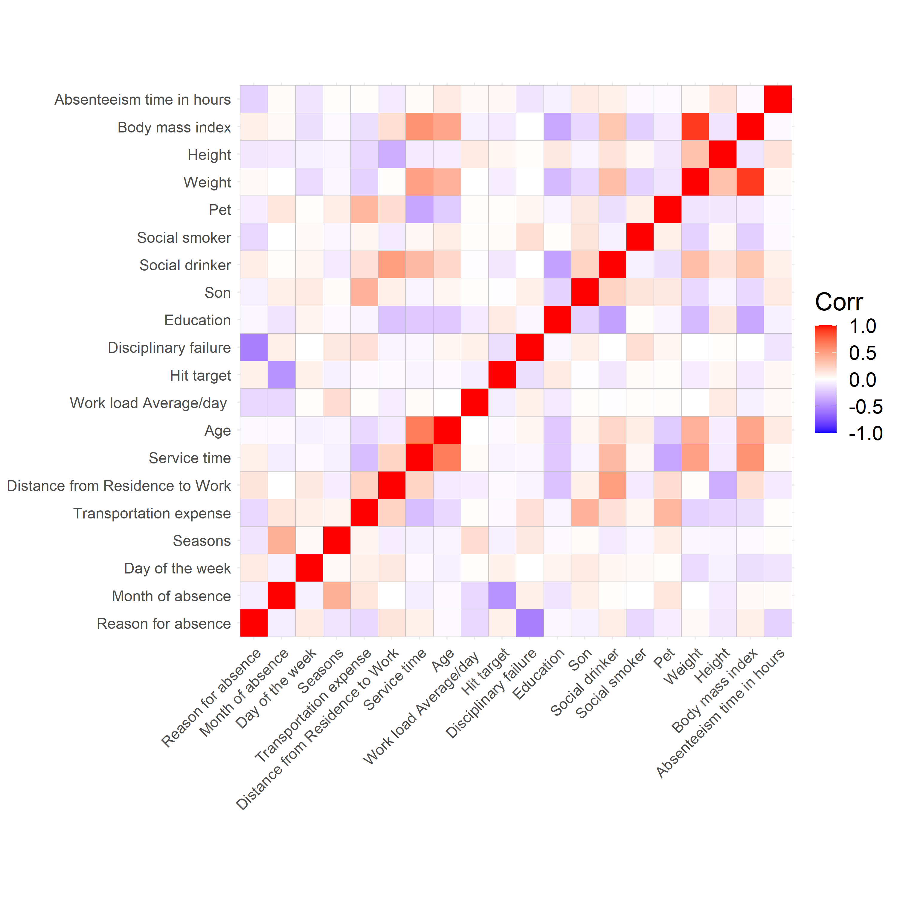
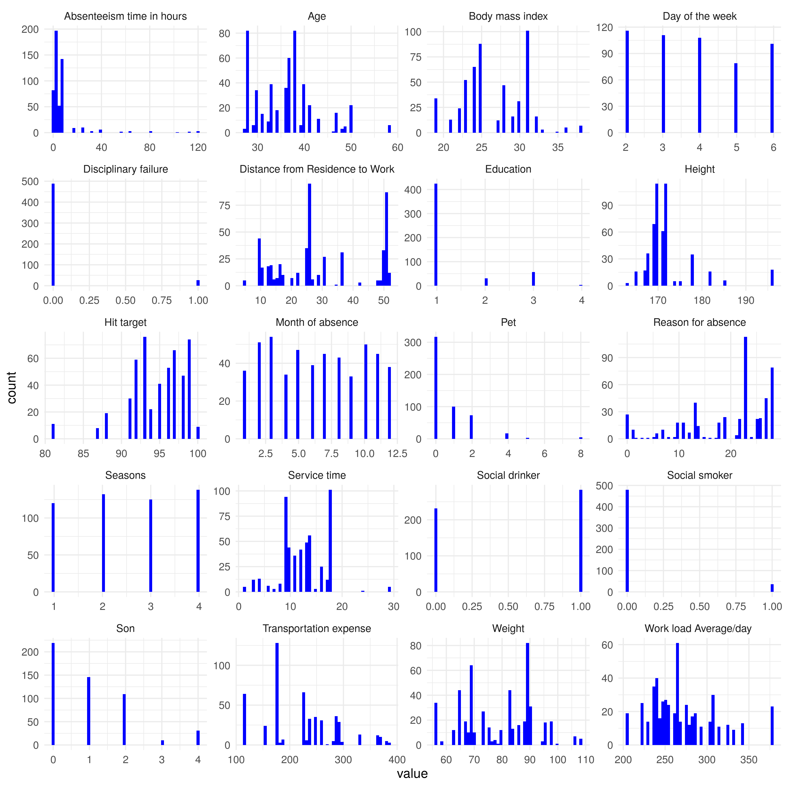
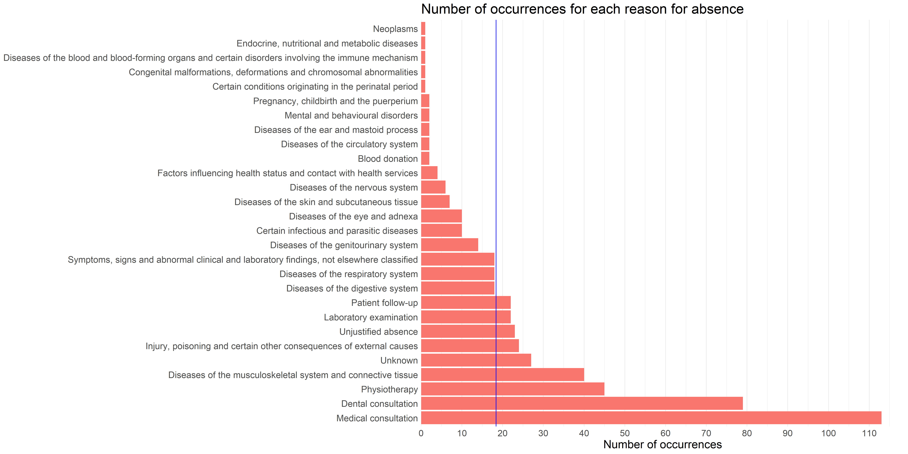
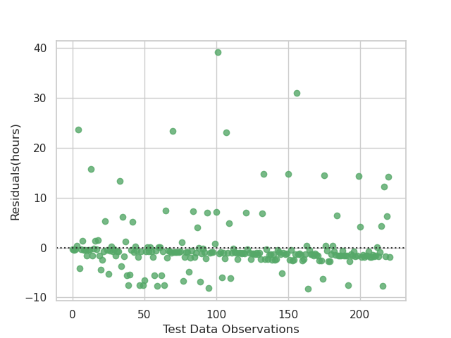

```{r setup, include=FALSE}
knitr::opts_chunk$set(echo = FALSE)
library(feather)
```

# Summary

> In this project, we are trying to address the following **predictive question**:

> Based on some given information of an employee, including personal, working and health situations, how many hours of absence would be expected from that employee?

To answer this question, three machine learning regression models were built: random forest regressor, support vector machine regressor with linear kernel, and ridge regressor to make predictions on absenteeism time in hours from the "Absenteeism at work" dataset.

Our final model support vector machine regressor with linear kernel performed a decent job on an unseen test data set, with negative RMSE score of -5.966. On 222 test data cases, the average hours that our model missed to predict is 5.966 hours, which is not bad at all. However, on both the train and test data, our prediction model tends to over predict when the actual absenteeism hours are low and underpredict if actual absenteeism hours are high (these are specific instances when the hours of absence are much higher than the mean).

Since our prediction results may affect the decision and judgment that an employer makes when dealing with absenteeism among employees, we suggest that more sophisticated approaches on machine learning algorithm and feature selection should be conducted to improve the prediction model before it is used to control and decipher absenteeism issues at the workplace.

# Introduction

Absenteeism in the workplace is the habitual absence behavior from work without a valid reason[@CIPD]. It is a very common case experienced by employers and it has become a serious problem that employers always want to deal with. The UK Chartered Institute of Personnel and Development(also known as CIPD) estimated that employers had to pay £595 on each employee per year and which is caused by 7.6 absent days from each worker on average in 2013[@book2]. In addition to higher financial costs, absenteeism might lead to reduced productivity levels, an underdeveloped teamwork environment and low morale in workplaces, which affects the overall operation of an organization.

Here we would like to experiment if we could use a machine learning model to make predictions and find the most influential features on absenteeism. If employers can use the results to predict absenteeism among employees, they can make effective plans in advance to deal with the upcoming problems and reduce extra costs caused by absenteeism.

# Data

We chose a data set from the UCI Machine Learning Repository called "Absenteeism at work Data Set". The data set can be found [here](https://archive.ics.uci.edu/ml/datasets/Absenteeism+at+work#) and it is created by Andrea Martiniano, Ricardo Pinto Ferreira, and Renato Jose Sassi from Postgraduate Program in Informatics and Knowledge Management at Nove de Julho University, Rua Vergueiro[@data]. The data was collected at a courier company in Brazil and the database includes the monthly records of absenteeism of 36 different workers over three years, starting from July 2007, and how their changes affect their absence rate over time. This data set contains 740 instances with 21 attributes, including 6 categorical and 9 numerical features (excluding the target `Absenteeism time in hours` and the drop feature `ID`, `Disciplinary failure`, `Body mass index`, `Service time`, and `Month of absence`). Each row represents information about an employee's situations of absence, family, workload, and other factors that might be related to absence at work. Out of the considered attributes, the absenteeism in hours is our prediction target.

# Methods

### Analysis tools

We used both R[@R] and Python[@Python] programming languages to perform this prediction task. The following R and Python packages were used: tidyverse[@tidyverse], dplyr[@dplyr], knitr[@knitr], ggcorrplot[@ggcorrplot], ggthemes[@ggthemes], arrow[@arrow], docopt R[@docopt], docopt Python[@docoptpython], feather Python[@featherpy], os[@Python], Pandas[@mckinney-proc-scipy-2010], scikit-learn[@sklearn_api], and Seaborn[@seaborn]. The code used to perform the analysis and create this report can be found [here](https://github.com/UBC-MDS/dsci-522_group-21).

### Preliminary data Analysis

Prior to preliminary data analysis and building the model, we split the data into a 515 training set and a 222 test set (70%:30% split). We assume that the test data set is representative of the deployment data that the model is going to face in the future. Therefore the test data set are saved and only be used to predict and score the trained model. Then we performed some exploratory data analysis (EDA) on the training data only:

From figure 1, We observed that there are some considerable correlations between features, even so more significant than the correlation with their respective target :`Absenteeism time in hours`.

-   The correlation matrix exposes that `Reason for absence`, `Day of the week`, `Height`, whether the employee had a `Disciplinary failure` that month, whether the worker considers him/herself a `Social drinker`, the `Distance from residence to work` and the `number of children` are the most influential features over the target `Absenteeism time in hours`. Nonetheless, these correlations only explain the individual associations between the features and the target. In a composed model where features interact with one another and multicollinearity is an issue, these initial correlations might not be a true representation of the influence the features have over the absenteeism hours, inside the model.

-   Furthermore, `Disciplinary failure` and `Reason for absence`; `Hit target` , `Month of absence`; and `Season of Absence`; `Body mass index` and `Weight`; and finally `Weight` and `Service time`, seem to be highly correlated features. As a result, we decided to drop the `Disciplinary failure`, `Body mass index`, `Service time`, as they have the lowest correlation with the target, and `Month of absence`, because it has a considerable number of levels which add unnecessary complexity to a model with over twenty explanatory variables. It is expected that the removal of these variables will help the models deal with the multicollinearity issues.

-   It is important to mention that the `ID` feature, representing the identification number of each employee that actively participated in the study as a subject, was also dropped (included in the drop features of the machine learning pipeline) as the deployment data would consider different employees with completely different identification numbers.

```{r correlation matrix, fig.cap="Figure 1. Correlation matrix between all features and the target", out.width = '100%'}

```

We looked into the distributions (figure 2) of all attributes, including the target `Absenteeism time in hours` and we detected many outliers in the target (extreme absenteeism times instances, much bigger than the mean absenteeism time of all the observations in the dataset). Therefore, we removed some extreme outliers. To decide with observations to discard, the removed the instances where the target was greater than its mean plus three times its standard deviation. Getting rid of these extreme instances is required, otherwise, the model will always be underpredicting. Fortunately, these cases represent only 15 of the 737 instances, therefore only a small amount of information is being ignored.

-   Although the mean absent hours per month of a worker is around 7 hours, there where the number of absent hours surpasses 60 hours per month, and even reaching a 120-hour mark.

-   Although initially, one would imagine that the season of the year would considerably affect the absence rate, all the weather seasons (and consequently the months) have almost the same number of observations. Nonetheless, the day of the week is quite crucial for understanding the absence behavior. Of the five business days, Tuesday has the biggest amount of absences.

-   There are three bizarre instances where there was a zero month reported causing this categorical feature to possess 13 different classes. These specific cases are going to be ignored as they lack any possible interpretation.

-   `Disciplinary failure`, `Social smoker` and `Education` level present a substantial class imbalance. Most of the workers that participated in the study have reached high school education by the end of it. Furthermore, only 27 of the over 500 subjects underwent disciplinary failure before the study. Finally, only 4% of the test subject are social smokers.

```{r frequency distributions, fig.cap="Figure 2. Frequency distributions for all features and the target", out.width = '100%'}

```

We examined the distribution for the particular feature `Reason of Absence` (figure 3), which has one of the relatively highest correlation with the target, and observe that justifications `Medical consultation` and `Dental Consultation` are the most common, justifying the absence of 191 out of the 508 observations of the training set portion. In addition, the overall **mean** number of occurrences for all `Reasons for absense` is around 20, which is much smaller than the most common occurrences.

```{r reasons of Absence distribution, fig.cap="Figure 3. Reasons of Absence feature distribution", out.width = '100%'}

```

### Data preprocessing and transforming

We built a preprocessing and transforming pipeline for all features: 'Standard Scaler' for numeric features, 'One Hot Encoding' for both categorical and binary features (including the specification to ignore them if they are binary), and 'Ordinal Encoding' for ordinal features. As mentioned before, dropped features ID, Disciplinary failure, Body mass index, Service time, and Month of absence to better deal with multicollinearity and interpretability issues. The scaling is required as the numeric features have different units (for example, number of children vs. Km from home to workplace) otherwise, the coefficients assigned through regression models cannot be compared.

### Prediction models & evaluation metric

Post EDA, we are ready to use supervised machine learning models to perform prediction and to obtain the most suitable algorithm for our Abseentism prediction task. The models we chose are:

-   `support vector machine with linear kernel` - we chose this model for its accuracy when a considerable amount of features are utilized, and the interpretability provided by the linear kernel, allowing us to determine the most influential features over the target.

-   `ridge regressor` - we selected this model to better deal with multicollinearity between the features. This model also provides coefficient to interpret the relationship between the features and the target.

-   `random forest regressor` - we chose this model for its efficiency and easiness to view relative feature importance.

For evaluation metric, both $R^2$ score and `negative root mean squared error` (`negative RMSE`) are used to assess how these models perform. Specifically, $R^2$ measures how well the models adapt and represent the training data, with 1 being making a perfect prediction and 0 being not having any predicting power; whereas `negative RMSE` measures how many absenteeism hours our prediction model misses in the validation / test data set. More importantly, we will focus on the `negative RMSE` because this measurement matters to our prediction task the most, as it will have the same units as our target (hours) while the $R^2$ is unitless, and it is a common used metric for out-of-sample prediction.

# Prediction results

### Cross validation

First, we performed cross validation on the train data set with 5 cross-validation folds using all 3 machine learning models. Table 1 shows the default mean cross-validation (cv) and train $R^2$ and `negative RMSE` scores for each machine learning model. The key takeaway from this table is that the `support vector machine with linear kernel` model seems to be a good candidate predictor model with least overfilling issues and similar `negative RMSE` mean cross-validation scores of around -5.35 to its peer models.

Given these closely performing `negative RMSE` mean cross-validation scores across all three models, we proceed with feature selection to try to filter down the most suitable model to use along with its associated most important features.

```{r default cv results}
non_RFE_CV_results <- read_feather("../results/non_RFE_CV_results.feather")
knitr::kable(non_RFE_CV_results, caption = "Table 1. Default mean cross validation negative root mean squared error & R-square scores of all three machine learning models")
```

### Feature selection & hyperparameter tuning

We used recursive feature elimination and cross-validated selection (`RFECV`) on the 3 machine learning models and we performed cross-validation again. Table 2 shows the mean cross-validation and train $R^2$ and `negative RMSE` scores based on the most important features selected associated with each of the 3 models. The key takeaway from this table is that the `support vector machine with linear kernel` model seems to be the best predictor model with least overfitting issues and this time a better `negative RMSE` mean cross-validation scores of -5.25 than its peer models.

```{r REF cv results}
RFE_CV_results <- read_feather("../results/RFE_CV_results.feather")
knitr::kable(RFE_CV_results, caption = "Table 2. Feature selection mean cross validation negative root mean squared error & R-square scores of all three machine learning models")
```

As a result, we picked `support vector machine with linear kernel` as our final prediction model. The 18 most important features (out of 49 total transformed features) of our final prediction model selected by REFCV are listed in descending order shown in table 3. with the majority of important features coming from `Reason for absence`. Furthermore `Tuesday` and whether or not an employee is a `social drinker` being another 2 important features out of the 19 selected.

In addition, we performed hyperparameter tuning on our final prediction model using `random search cross validation` and the best hyperparameters given are gamma of 0.1 and C of 1 (both complexity hyperparameters that control the fundamental tradeoff), while hyperparameter tuning did not improve further our -5.25 `negative RMSE` mean cross-validation scores.

```{r best coefficients}
best_coefficients <- read_feather("../results/best_coefficients.feather")
knitr::kable(best_coefficients, caption = "Table 3. Top 18 important features selected with associated coefficients under support vector machine linear regressor prediction model")
```

### Test result

Now we are ready to use our final prediction model `support vector machine with linear kernel` on our test data set. The final test `negative RMSE` score is -5.966, which is very close to the cross validation scores we got previously, which is a good indicator that our model generalizes well on the unseen test set.

Lastly, we included the residual plot in Figure 4, which shows the residuals of our predictions on Y axis and all the actual test targets on the X axis. We can see that the majority of our prediction residuals are clustered around 0 throughout the entire test data set, and our prediction model is performing a decent job in predicting the hours of absence from a worker with some errors.

```{r residual plot, fig.cap="Figure 4. Prediction residuals vs actual test target values", out.width = '100%'}

```

# Discussions

### Critique

There are limitations and assumptions associated with our prediction task:

-   The dataset is collected from one single courier company in Brazil, which means that the data might not be independent and representative of the population that we are interested in predicting. A correct approach would be to collect information of different companies, in different countries and from employers with different hierarchical levels within the company.

-   From the preliminary data analysis, we see that there is no strong correlation between each single feature and the target, which is a signal that there might not be a great representation of target from the given features. There are obvious multicollinearity in between features, which we decided on removing prior to training our machine learning models, and this might not have been the best approach to deal with multicollinearity.

-   In addition, from the frequency distributions, there are many outliers in our target, so we decided on removing some prior to training our models, which also might not have been the most effective way to deal with outliers, and could potentially make our prediction model more sensitive and less robust when it comes to predicting on extreme cases.

### Future directions

Given the current Machine Learning tools we have learned so far, we were able to answer our predictive question in a basic manner. If we were to have more time to explore deeper, we would 1. research into more advanced machine learning models that particularly deal with collinear and outlier data; 2. find and use a more representative and independent dataset that could better represent the population to perform analysis and prediction on. Perhaps more complex ensemble models like Catboost or even a stacked model could prove to be useful in increasing the predicting capability of the answer. Observing the hyperparameters selected during the optimization, the model seems to have a considerably elevated complexity, hence some sort of regularization,where the models of high complexity are penalized might prove to be useful in this particular task.

# References
