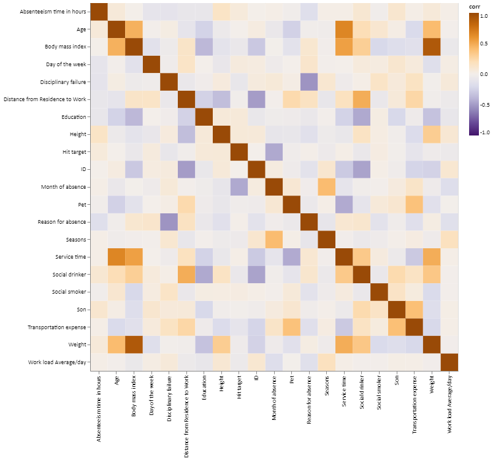
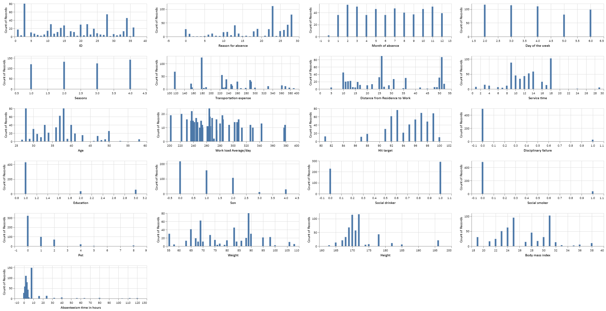
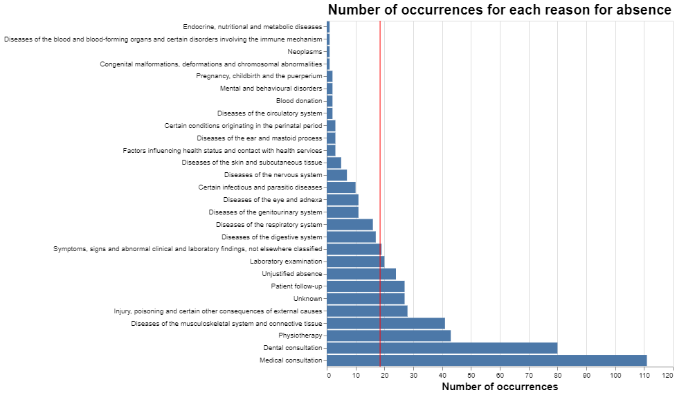
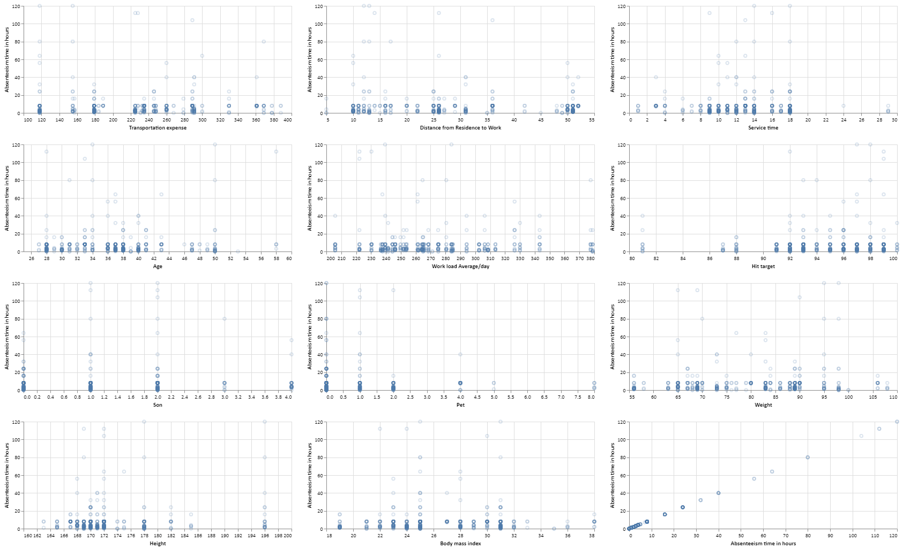
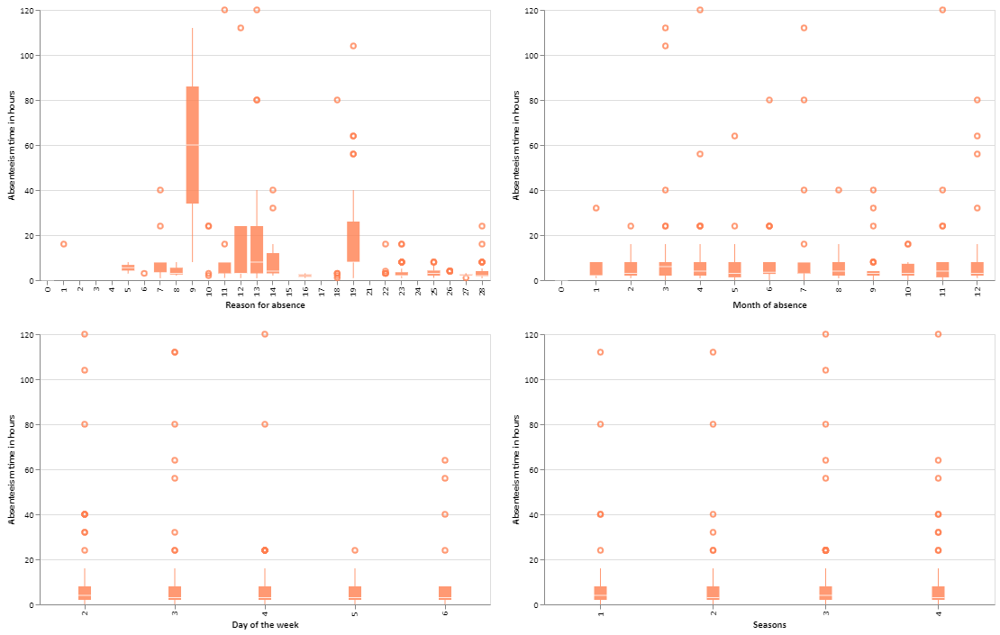
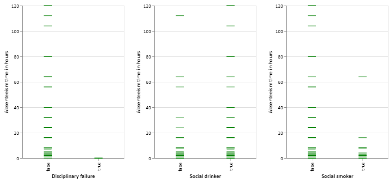
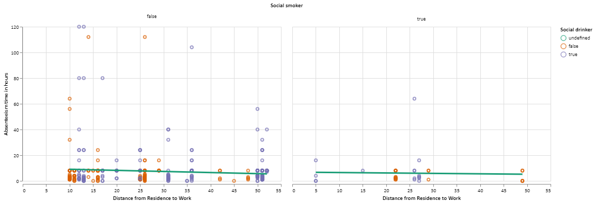
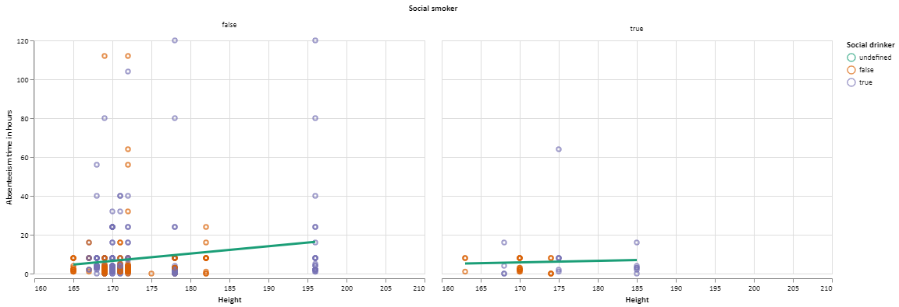
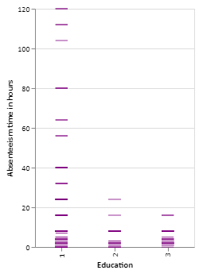

Exploratory data analysis (EDA) of the Absenteeism at work Data Set
===================================================================

> The objective of this exploratory data analysis is to comprehend the
> relationship between the features and the absenteeism time in hours to
> obtain an initial general idea of which features are the most
> influential over the target. Additionally, studying the correlation
> between features may provide significant insights about colinear
> variables and this may affect the decision of which prediction model
> to utilize in the prediction phase of our project.

    ## <class 'pandas.core.frame.DataFrame'>
    ## RangeIndex: 740 entries, 0 to 739
    ## Data columns (total 21 columns):
    ##  #   Column                           Non-Null Count  Dtype   
    ## ---  ------                           --------------  -----   
    ##  0   ID                               740 non-null    int64   
    ##  1   Reason for absence               740 non-null    category
    ##  2   Month of absence                 740 non-null    category
    ##  3   Day of the week                  740 non-null    category
    ##  4   Seasons                          740 non-null    category
    ##  5   Transportation expense           740 non-null    int64   
    ##  6   Distance from Residence to Work  740 non-null    int64   
    ##  7   Service time                     740 non-null    int64   
    ##  8   Age                              740 non-null    int64   
    ##  9   Work load Average/day            740 non-null    float64 
    ##  10  Hit target                       740 non-null    int64   
    ##  11  Disciplinary failure             740 non-null    bool    
    ##  12  Education                        740 non-null    category
    ##  13  Son                              740 non-null    int64   
    ##  14  Social drinker                   740 non-null    bool    
    ##  15  Social smoker                    740 non-null    bool    
    ##  16  Pet                              740 non-null    int64   
    ##  17  Weight                           740 non-null    int64   
    ##  18  Height                           740 non-null    int64   
    ##  19  Body mass index                  740 non-null    int64   
    ##  20  Absenteeism time in hours        740 non-null    int64   
    ## dtypes: bool(3), category(5), float64(1), int64(12)
    ## memory usage: 83.8 KB

> The overall description of the data informs that there is no missing
> value and that all the columns were initially considered numeric.
> Hence, column transformations are required for the categorical
> variables. During the data transformation and preprocessing,
> imputation is not going to be required.

> Before starting EDA, the data is separated into the training and test
> portions using a 70 : 30 train test split. With this division, the
> test set, which will be used to score the model, will not influence
> the training phase of the predictive model in any way.

Summary of the data set
=======================

Value Count Table
-----------------

    ##                                  Unique Value Count
    ## ID                                               35
    ## Reason for absence                               28
    ## Month of absence                                 13
    ## Day of the week                                   5
    ## Seasons                                           4
    ## Transportation expense                           24
    ## Distance from Residence to Work                  25
    ## Service time                                     17
    ## Age                                              22
    ## Work load Average/day                            38
    ## Hit target                                       13
    ## Disciplinary failure                              2
    ## Education                                         3
    ## Son                                               5
    ## Social drinker                                    2
    ## Social smoker                                     2
    ## Pet                                               6
    ## Weight                                           25
    ## Height                                           14
    ## Body mass index                                  16
    ## Absenteeism time in hours                        18

Overall exploratory data analysis
=================================

Correlation Matrix
------------------

-   The correlation matrix exposes that `reason for absence`, the
    business `day of the week`, the `height`, whether the employee had a
    `disciplinary failure` that month, whether the worker considers
    him/herself a `social drinker`, the
    `distance from residence to work` and the number of `children` are
    the most influential features over the `target`
    (`absence time in hours`).

-   On the other hand, the matrix reveals a considerable amount of
    features that do not have a significant association with the target
    like the `smoker` tendencies, the number of `pets` at home, the
    workers unique `id`, and their respective `service time`.

-   Furthermore, it is exposed that some features have significant
    correlations between each other and therefore, provide similar
    information to the model.

-   Some good examples of these cases are `weight`, `height`, and
    `body mass index`, and `season` and `month`. Taking this into
    consideration, a `linear regression` cannot be considered as a
    suitable predictive model, as it is very susceptible to
    multicollinearity. A `ridge regression` model would be much more
    appropriate.

Frequency Distributions for all features
----------------------------------------

-   The plots presented above expose the distributions of all the
    features, including the `target`. At first glance, we observe that
    the **target column has a considerable number of outliers**.
    Although the mean absent hours per month of a worker is around 7
    hours, there is a noteworthy amount of instances where the number of
    absent hours surpasses 20 hours per month, and even reaching a
    120-hour mark.

-   Although initially, one would imagine that the season of the year
    would considerably affect the absence rate, all the weather seasons
    (and consequently the months) have almost the same number of
    observations. Nonetheless, the day of the week is quite crucial for
    understanding the absence behavior. Of the five business days,
    **Tuesday has the biggest amount of faulters**.

-   There are three bizarre instances where there was a zero month
    reported causing this categorical feature to possess 13 different
    classes. These specific cases are going to be ignored as they lack
    any possible interpretation.

-   `Disciplinary justification`, `Social Smoker` and
    `Level on Education` present a substantial class disbalance. Most of
    the workers that participated in the study have reached high school
    education by the end of it. Furthermore, only 27 of the over 500
    subjects underwent disciplinary failure before the study. Finally,
    only 4% of the test subject are social smokers.

Reasons of Absence Table
------------------------

    ##                                                                                                      Number of occurrences  Frequency
    ## Reason for absence                                                                                                                   
    ## Medical consultation                                                                                                   111   0.214286
    ## Dental consultation                                                                                                     80   0.154440
    ## Physiotherapy                                                                                                           43   0.083012
    ## Diseases of the musculoskeletal system and connective tissue                                                            41   0.079151
    ## Injury, poisoning and certain other consequences of external causes                                                     28   0.054054
    ## Patient follow-up                                                                                                       27   0.052124
    ## Unknown                                                                                                                 27   0.052124
    ## Unjustified absence                                                                                                     24   0.046332
    ## Laboratory examination                                                                                                  20   0.038610
    ## Symptoms, signs and abnormal clinical and laboratory findings, not elsewhere classified                                 19   0.036680
    ## Diseases of the digestive system                                                                                        17   0.032819
    ## Diseases of the respiratory system                                                                                      16   0.030888
    ## Diseases of the eye and adnexa                                                                                          11   0.021236
    ## Diseases of the genitourinary system                                                                                    11   0.021236
    ## Certain infectious and parasitic diseases                                                                               10   0.019305
    ## Diseases of the nervous system                                                                                           7   0.013514
    ## Diseases of the skin and subcutaneous tissue                                                                             5   0.009653
    ## Certain conditions originating in the perinatal period                                                                   3   0.005792
    ## Diseases of the ear and mastoid process                                                                                  3   0.005792
    ## Factors influencing health status and contact with health services                                                       3   0.005792
    ## Pregnancy, childbirth and the puerperium                                                                                 2   0.003861
    ## Mental and behavioural disorders                                                                                         2   0.003861
    ## Blood donation                                                                                                           2   0.003861
    ## Diseases of the circulatory system                                                                                       2   0.003861
    ## Endocrine, nutritional and metabolic diseases                                                                            1   0.001931
    ## Diseases of the blood and blood-forming organs and certain disorders involving the immune mechanism                      1   0.001931
    ## Neoplasms                                                                                                                1   0.001931
    ## Congenital malformations, deformations and chromosomal abnormalities                                                     1   0.001931

-   Out of the `reasons for absence`, justifications **22 (medical
    consultation)** and **27 (Dental Consultation) are the most
    common**, causing the reasons for absence in 191 out of the 508
    observations taken.

-   On the other hand, affections related to the endocrine system,
    neoplasms, and disorders involving the immune and hemocytoblast
    production are the least common factors of absenteeism, only being
    used as an excuse by the employees once each.

Numeric data analysis
=====================

-   The scatterplots between the `numeric features` and the `target`
    support the analysis made with the correlation matrix, where there
    is **NO detectable tendency or relation between the variables and
    the target**. Some examples of this behavior are `Service Time`,
    `Weight`, `Transportation Expense`, `Body Mass Index`, and `Age`.

-   Regarding the `Hit Target` or achievement percentage, the highest
    absence rates come from the workers with the best hit target
    percentages. Probably, the workers with a low target rate are aware
    of their situation and avoid any faults unless it is necessary.
    Meanwhile, workers with a high hit target give themselves the luxury
    of missing more labor hours as they consider that their primary
    objectives (possibly week objectives) have been accomplished.

-   `Body mass index` is revealed to be more influential over the target
    than the worker´s `weight`, as the body mass index has a significant
    (albeit in a small amount) tendency line, where the body mass is
    indirectly proportional to the absenteeism time.

-   Finally, although the no-`children` was the most common
    consideration registered, The biggest number of significant outliers
    come from the workers with one or two children.

Categorical data analysis
=========================

-   For the boxplots depicting the relationship between the
    `Reason of Absence` and the `target`, factors related to diseases of
    the **circulatory system (9)** and **injuries, poisoning, and
    certain other consequences of external causes (19)** have the
    **highest median absenteeism time in hours**. Particularly, although
    they are far from being the most common absence causes, their
    consequences are much more severe, causing the employee to miss a
    considerable of time each time the occurrence happens.

-   Analyzing the `day of the week`, **Monday has the highest
    absenteeism time median even though Tuesday has the highest count
    value** (both of them deploy the highest outlier count).

Binary data analysis
====================

-   In only 27 of the instances, the worker had a
    `disciplinary failure`, meaning he or she had received a
    disciplinary warning and no absence hours would be tolerated.

-   Because the consequences or being a `social smoker` or
    `social drinker` are not sufficiently clear with the tick plot, two
    new plots relating the `distance from residence to work` and the
    `height` (two influential features over the target) were made,
    coloring and faceting by whether the worker is a social drinker or
    smoker.

-   The plots reveal that, although the `social smoker` feature does not
    appear to be relevant, as most of the workers were never social
    smokers during the study, the `social drinking` habit does influence
    the target, as most of the outliers are social drinkers.

Ordinal data analysis
=====================

-   The only ordinal feature included in the dataset is the
    `education level`, going from high school to master/doctorate
    education. Nonetheless, the fourth level of education is very
    scarse, not being found in the training set. Because the only two
    observations in which the fourth level of education was acquired are
    present in the test set, the model is going to ignore them during
    the scoring.

Insights & Conclusions
======================

The most important insights provided by this study are:

> The **correlation** reveals that the `reason of absence`, that the
> absence factors, the `business day of the week`, the `height`, whether
> the employee had a `disciplinary failure` that month, whether the
> worker considers him/herself a `social drinker`, the
> `distance from residence to work` and the number of `children` are the
> **most influential features over absenteeism time in hours**.

> The `target` contains a **considerable amount of outliers**. Although
> the average amount of absence hours per subject is 6.87 hours, there
> are a considerable amount of instances of over 30 labor hours missed,
> even reaching the 120-hour mark. During the model design, it is
> important to utilize an implementation that deals with these outliers.

> Overall the `categorical features` are shown to be **much influential
> than** the `numerical features`.

> The **most common factors of absence** are **not necessarily causing**
> the **most significant absence rate**, as there are more severe
> circumstances that cause more absence time per occurrence.

> Both `Supported Vector Machine` and `Ridge regression` appear to be
> good model candidates for this dataset, as `SVM` has **good accuracy
> when there are a considerable amount of features**, and
> `ridge regression` can **deal with the multicollinearity between the
> features**.

> The `ID` feature, indicating the worker does not appear to have any
> time of significance and it **can be dropped from the model**.
